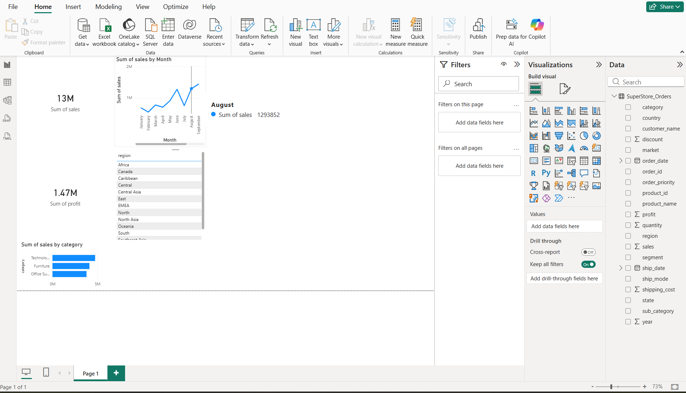

# powerbi-sales-dashboard
# Sales Performance Dashboard – Power BI

This project presents an interactive Power BI dashboard to analyze sales and profit trends
across regions and product categories.

## Features
- KPI Cards: Total Sales, Total Profit
- Sales by Category (Bar Chart)
- Monthly Sales Trend (Line Chart)
- Region-based filtering (Page-level filter)

## Tools Used
- Power BI
- Data Visualization
- CSV Dataset

## Dashboard Preview

